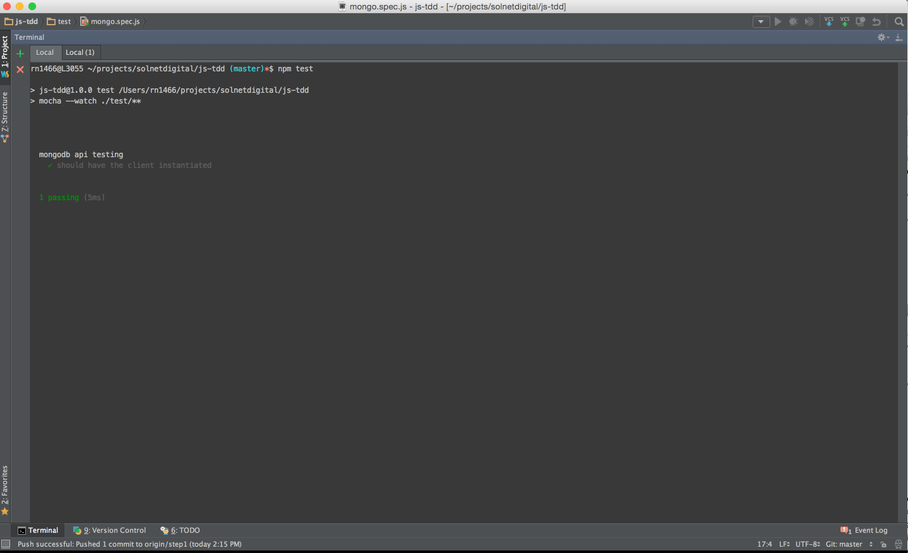

# JS-TDD

## Step 1 - Installation

This exercise is all about how to think on creating a test driven development for getting to know a new API, and 
how to improve/design better and cleaner code using unit tests.

To follow the tutorial, we first need to checkout the project from github as a starting point.

So in your command line, type

```
git clone https://github.com/solnetdigital/js-tdd.git 
```

Then navigate to the folder and execute the following command to install all the needed dependencies for the tutorial:

```
npm install
```

## Step 2 - Getting started

TDD (Test Driven Development) is a very easy concept to grasp.

Basically, you start creating a test for a particular feature. 

If the language/tooling allows you, you should be able to create/change the test and have immediate feedback about the code that you're creating.

In some languages this is quite challenging, since there is a full compilation/deployment cycle. But that's not the case for node/io js.

So before starting to code, just execute the following command:

```
npm test
```

You should have immediate feedback just like this:



The mongo.spec.js file has a small fixture, testing if the mongodb api barebone (MongoClient) is
defined.

This is the starting point for your TDD, since every time you change the mongo.spec.js file and save, the mocha
tests will be fired again.

## Next Steps
It's time to start enhancing the test development cycle with baby steps, or small increments on the code.

[Go to Step 1](./docs/STEP1.md)
