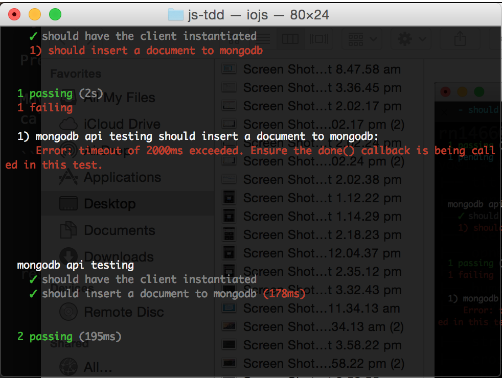
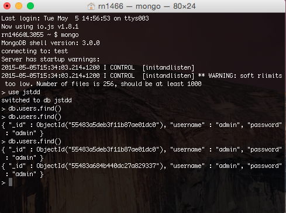
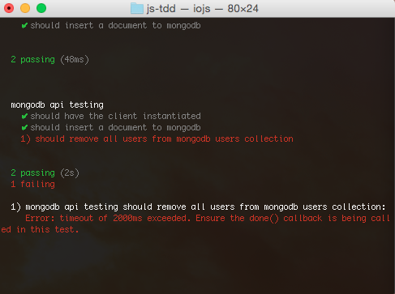
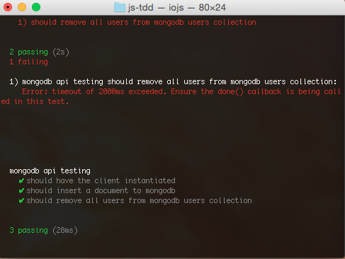
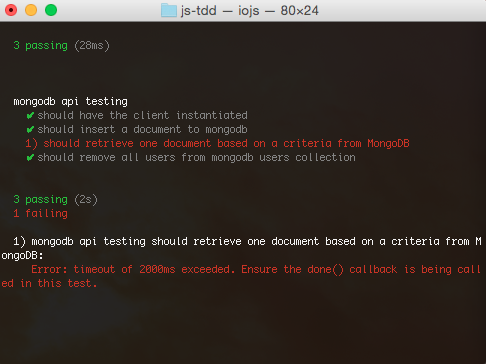
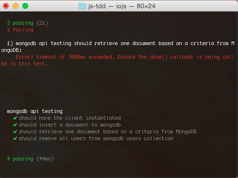

# JS-TDD

## Step 1 - Start mocha

The purpose of this exercise is to get used with a TDD approach.

Historically, the TDD approach originated back in the XP (Extreme Programming) practices, where a programmer had to develop in a cycle comprising make the minimum code to fail the test -> improve the test code -> execute the test, until the test passes.
 
This cycle was first envisaged by the XP virtuoso Kent Beck, which encourages simple design and inspires confidence on building robust software based on simple, testable and solid building blocks.

So, to start our TDD session, go to the project folder on console and type:

```
npm test
```

Now that mocha has started, let's start to add more features.

## Step 1.1 - Start Mongodb

Open another terminal window, and start mongodb on this window, typing

```
mongod --dbpath ~/data
```

I'm using here `~/data` because I've created this folder to store the mongodb data files. If you want to create a folder with a different name/path, feel free to do it.

After this command, mongodb will be available for connections on the default port (`localhost:27017`).

## Step 1.2 - Add connection code to the testcase

We need to create a mongodb connection in this step. I assume that the code was downloaded from master branch in git, so you can perform all the steps of the tutorial.

Let's start by checking the current code of `mongo.spec.js` file:

```javascript
/**
 * Test imports
 */
var chai = require('chai');
var should = require('chai').should();

/**
 * First version - creating a mongodb simple API using callbacks
 */
var client = require('mongodb').MongoClient;

describe('mongodb api testing', function() {
  var url = 'mongodb://localhost:27017/jstdd';
  it('should have the client instantiated', function(){
    client.should.be.defined;
  });
});
```
This step is mostly to create a connection and assert if the connection is defined on the callback function.

```javascript
/**
 * Test imports
 */
var chai = require('chai');
var should = require('chai').should();
var expect = require('chai').expect; // change0

/**
 * First version - creating a mongodb simple API using callbacks
 */
describe('mongodb api testing', function() {
	var client = require('mongodb').MongoClient,
		url = 'mongodb://localhost:27017/jstdd',
		connect; // change1
	beforeEach(function(done){ // #exp1
		connect = client.connect(url, function(err, db) {
			db.should.be.defined; // #exp2
			expect(err).to.be.null; // #exp3
			db.close();
			done(); // #exp1
		});
	}); // change2
	it('should have the client instantiated', function(){
    	client.should.be.defined;
	});
});
```
### Explanation

We added __change0__ to be able to use the expect chai construct in the testcase as well.

`expect` is used in this case because one of the variables that we need to assert may be null or undefined, which doesn't allow us to use only should.

We added __change1__ to remove all non-global variables from global scope, adding the connection variable.

In __change2__ we added a beforeEach block. This block executes before every test in the same describe scope. To know more about these mocha constructs, please refer to [Mocha documentation](http://mochajs.org/).

There are some interesting features in the beforeEach block.

In __#exp1__, we are passing to the beforeEach internal function a done parameter. This parameter is used to communicate to mocha test that the asynchronous callback has already ended.

We need to notify calling the `done()` method, so mocha doesn't timeout the test.

In __#exp2__, we are asserting if the db parameter of the connection callback is defined. For a variable to be defined, it should not be null nor undefined.

In __#exp3__, we are asserting if the err parameter is null. If the err parameter was not null or was defined, the connection was unsuccessful, hence the test would fail.

After changing the code and saving the file, we should see the test executing again in the console window, like this:


If you are in a more advanced part of the test driven session, you should have the confidence that your api did not break after changing the code.

## Step 1.3 - Adding a document to mongodb

Now, let's insert a document to mongodb.

But first things first, let's create the should block where we will place our test code.

```javascript
    //...  code ommited for brevity
	it('should insert a document to mongodb', function(done) {
		// code will go here
	});
}); // describe scope end
```
If you save the file right now, we will have a test failure. That's basically because we are defining that the test is an asynchronous test (by using the `done` parameter on the `it` function), and not calling the `done()` method on the test body.

The result that we have is the following:


Pretty self explanatory message, right?

Moving on, to insert a document in mongodb, we need to be on a connection callback, to access a connected db parameter.

```javascript
	// ... code ommited for brevity
	it('should insert a document to mongodb', function(done) {
		client.connect(url, function(err, db){ // #exp1
			db.collection('users') // #exp2
				.insertOne({username:'admin', password:'admin'}, function(err, result){ //#exp3
					result.should.be.ok; //#exp4
					expect(err).to.be.null; //#exp4
					done(); //#exp5
				});
		});

	});
}); // describe scope end
```

### Explanation
In __#exp1__, we are starting the connection to make mongodb commands. These commands have to be placed on the connect function node.js callback.

In __#exp2__, we are calling `db.collection` function, with the `'users'` parameter, which means that we are using the collection `users` for the next command in the chain.

In __#exp3__, we are using the `insertOne` function, that takes a JSON object as a document, and a node.js callback that will be executed after the function execution completes in mongodb.

In __#exp4__, we are performing the normal assertions for this case, like expecting that the result parameter should be ok, and the err parameter to be null.

And finally, in __#exp5__, we are invoking the `done()` notification function to end the test scenario.

Pretty simple, right? We are getting our hands dirty and seeing that our tests are working as expected.



## Step 1.4 - Removing documents from mongodb

That was sweet, inserting a document to mongodb. But as we did not define any indexing to our collection, every time that we execute the insertOne function, a new identical document will be inserted.
And as a result we have this:



Not that much fun huh? 

So we will add a test to call the deleteMany function on mongoDB, to delete all repeated documents from the mongo database.
The deleteMany function have two main parameters - one is a query object (a criteria object to be used as a match to find the documents to delete), and the other parameter is the node callback that is called after executing the deleteMany function.

We can start adding the following code to the bottom of the inner part of the describe scope and save:

```javascript
	// ... code ommited for brevity
	it('should remove all users from mongodb users collection', function(done){
	});
}); // describe scope end
```

Don't worry - again, as we save, we will have a failed test on the report - nothing out of the ordinary here.



So let's complete our test code to make it pass.

```javascript
	// ... code ommited for brevity
	it('should remove all users from mongodb users collection', function(done){
		client.connect(url, function (err, db) {
			db.collection('users')
				.deleteMany({username:'admin'}, function(err, result){ // #exp1
					expect(err).to.be.null; // #exp2
					result.should.be.ok; // #exp2
					done(); // #exp3
       	});
	    });
	});
}); // describe scope end
```

### Explanation

In __#exp1__, we are using the `deleteMany` function, that takes a JSON object as a query, and a node.js callback that will be executed after the function execution completes in mongodb.

In __#exp2__, we are performing the normal assertions for this case, like expecting that the result parameter should be ok, and the err parameter to be null.

And finally, in __#exp3__, we are invoking the `done()` notification function to end the test scenario.

After performing the changes and saving, we can see that we had a different result on the test execution on the terminal.



Sweet! Now we have a full cycle of insertion and removal on our unit test. But what about retrieving information?

## Step 1.5 - Find one document in mongoDB

Right, we have one document stored in mongoDB after the insert testcase executes, that the deleteMany testcase cleans on its execution.

So what about putting a test case to find the inserted document before removing it?

As usual, let's go by the baby steps - add the following function right after the insert document testcase, and save:

```javascript
	// ... code ommited for brevity
	it('should retrieve one document based on a criteria from MongoDB', function(done){
	
	});
	// ... code ommited for brevity
```

We should see a failing test report, but hey - we are adding one more testcase here, so it is expected.



All right, let's put the findOne code on the testcase, shall we?

```javascript
// ... code ommited for brevity
	it('should retrieve one document based on a criteria from MongoDB', function(done){
		client.connect(url, function (err, db) {
			db.collection('users')
				.findOne({username:'admin'}, function(err, result){ // #exp1
					expect(err).to.be.null; // #exp2
					result.should.be.ok; // #exp2
					result.should.have.property('username')
						.equals('admin'); // #exp2
					result.should.have.property('password')
						.equals('admin'); // #exp2
					result.should.have.property('_id'); // #exp2
					done(); // #exp3
       	});
	    });
	});
	// ... code ommited for brevity
```
### Explanation

In __#exp1__, we are using the `findOne` function, that takes a JSON object as a criteria query, and a node.js callback that will be executed after the function execution completes in mongodb. On this node callback, the result parameter will be the exact object that we expect retrieved from mongodb.

In __#exp2__, we are performing the normal assertions for this case, like expecting that the result parameter should be ok, and the err parameter to be null. In this case, as the result parameter is an actual document from mongodb, we expect that some values and properties are present, so we created more assertions for this case.

And finally, in __#exp3__, we are invoking the `done()` notification function to end the test scenario.

After performing the changes and saving, we can see that we had a different result on the test execution on the terminal.



Awesome! We just need to create one more test case - to retrieve a list of documents from mongoDB. And we will make use of regex operator of mongoDB for this feature.

## Step 1.6 - Find a list of documents in mongoDB


