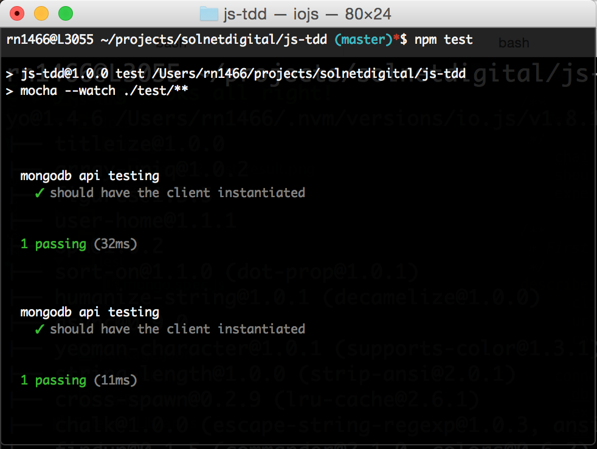
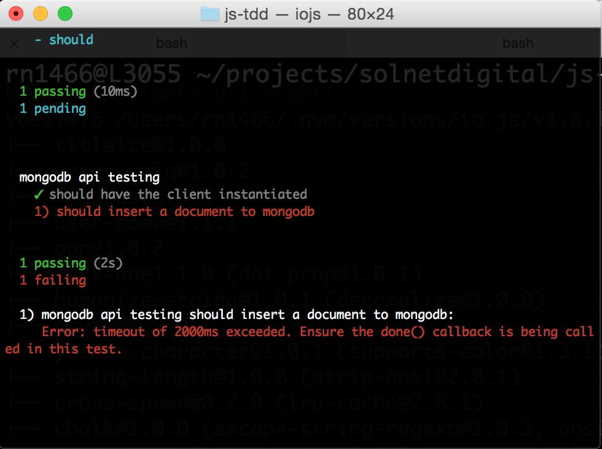

# JS-TDD

## Step 1 - Start mocha

The purpose of this exercise is to get used with a TDD approach.

Historically, the TDD approach originated back in the XP (Extreme Programming) practices, where a programmer had to develop in a cycle comprising make the minimum code to fail the test -> improve the test code -> execute the test, until the test passes.
 
This cycle was first envisaged by the XP virtuoso Kent Beck, which encourages simple design and inspires confidence on building robust software based on simple, testable and solid building blocks.

So, to start our TDD session, go to the project folder on console and type:

```
npm test
```

Now that mocha has started, let's start to add more features.

## Step 1.1 - Start Mongodb

Open another terminal window, and start mongodb on this window, typing

```
mongod --dbpath ~/data
```

I'm using here `~/data` because I've created this folder to store the mongodb data files. If you want to create a folder with a different name/path, feel free to do it.

After this command, mongodb will be available for connections on the default port (`localhost:27017`).

## Step 1.2 - Add connection code to the testcase

We need to create a mongodb connection in this step. I assume that the code was downloaded from master branch in git, so you can perform all the steps of the tutorial.

Let's start by checking the current code of `mongo.spec.js` file:

```
/**
 * Test imports
 */
var chai = require('chai');
var should = require('chai').should();

/**
 * First version - creating a mongodb simple API using callbacks
 */
var client = require('mongodb').MongoClient;

describe('mongodb api testing', function() {
  var url = 'mongodb://localhost:27017/jdtdd';
  it('should have the client instantiated', function(){
    client.should.be.defined;
  });
});
```
This step is mostly to create a connection and assert if the connection is defined on the callback function.

```
/**
 * Test imports
 */
var chai = require('chai');
var should = require('chai').should();
var expect = require('chai').expect; // change0

/**
 * First version - creating a mongodb simple API using callbacks
 */
describe('mongodb api testing', function() {
	var client = require('mongodb').MongoClient,
		url = 'mongodb://localhost:27017/jdtdd',
		connect; // change1
	beforeEach(function(done){ // #exp1
		connect = client.connect(url, function(err, db) {
			db.should.be.defined; // #exp2
			expect(err).to.be.null; // #exp3
			db.close();
			done(); // #exp1
		});
	}); // change2
	it('should have the client instantiated', function(){
    	client.should.be.defined;
	});
});
```

We added __change0__ to be able to use the expect chai construct in the testcase as well.

`expect` is used in this case because one of the variables that we need to assert may be null or undefined, which doesn't allow us to use only should.

We added __change1__ to remove all non-global variables from global scope, adding the connection variable.

In __change2__ we added a beforeEach block. This block executes before every test in the same describe scope. To know more about these mocha constructs, please refer to [Mocha documentation](http://mochajs.org/).

There are some interesting features in the beforeEach block.

In __#exp1__, we are passing to the beforeEach internal function a done parameter. This parameter is used to communicate to mocha test that the asynchronous callback has already ended.

We need to notify calling the `done()` method, so mocha doesn't timeout the test.

In __#exp2__, we are asserting if the db parameter of the connection callback is defined. For a variable to be defined, it should not be null nor undefined.

In __#exp3__, we are asserting if the err parameter is null. If the err parameter was not null or was defined, the connection was unsuccessful, hence the test would fail.

After changing the code and saving the file, we should see the test executing again in the console window, like this:



If you are in a more advanced part of the test driven session, you should have the confidence that your api did not break after changing the code.

## Step 1.3 - Adding a document to mongodb

Now, let's insert a document to mongodb.

But first things first, let's create the should block where we will place our test code.

```
... // code ommited for brevity
	it('should insert a document to mongodb', function(done) {
		// code will go here
	});
}); // describe scope end
```
If you save the file right now, we will have a test failure. That's basically because we are defining that the test is an asynchronous test (by using the `done` parameter on the `it` function), and not calling the `done()` method on the test body.

The result that we have is the following:



Pretty self explanatory message, right?

Moving on, to insert a document in mongodb, we need to be on a connection callback, to access a connected db parameter.

```
... // code ommited for brevity
	it('should insert a document to mongodb', function(done) {
		client.connect(url, function(err, db){ // #exp1
			db.collection('users') // #exp2
				.insertOne({username:'admin', password:'admin'}, function(err, result){ #exp3
					result.should.be.ok; #exp4
					expect(err).to.be.null; #exp4
					done(); #exp5
			});
		});

	});
}); // describe scope end
```